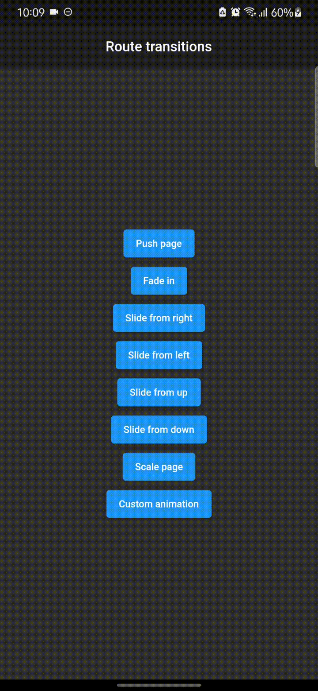
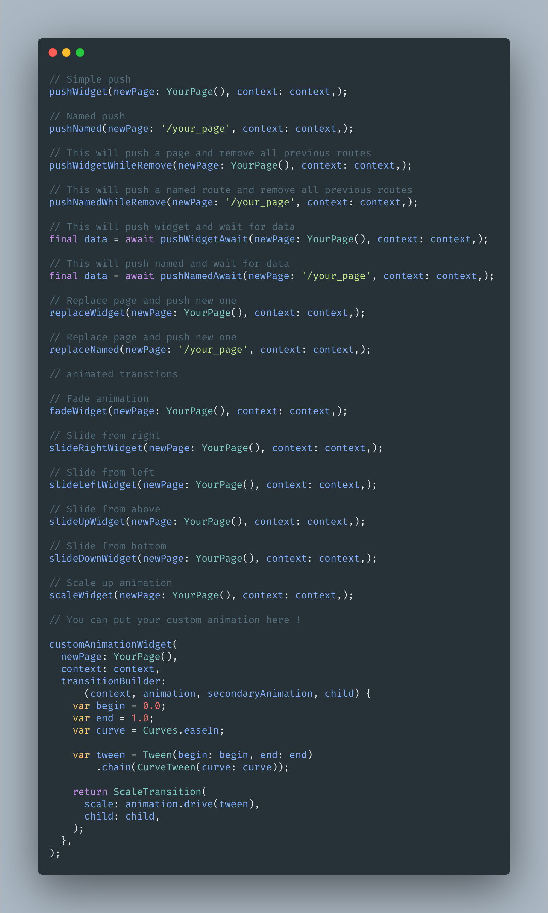

# Route transitions



Now supports latest dart null safety . This package has been rewritten to use friendly route functions to navigate even with your favourite route transition and ability to build custom animations with `tansitionBuilder` !

## How to use

```dart
import 'package:route_transitions/route_transitions.dart';

ElevatedButton(
  onPressed: () => pushWidget(
    newPage: Dashboard(),
    context: context,
  ),
  child: Text("Push page"),
),
```

## Friendly API



For actual examples , check [example/lib/main.dart](https://github.com/pacifio/route_transitions/blob/master/example/lib/main.dart)

## Custom animation with `customAnimationWidget`

```dart
customAnimationWidget(
  newPage: YourPage(),
  context: context,
  transitionBuilder:
      (context, animation, secondaryAnimation, child) {
    var begin = 0.0;
    var end = 1.0;
    var curve = Curves.easeIn;

    var tween = Tween(begin: begin, end: end)
        .chain(CurveTween(curve: curve));

    return ScaleTransition(
      scale: animation.drive(tween),
      child: child,
    );
  },
)
```
